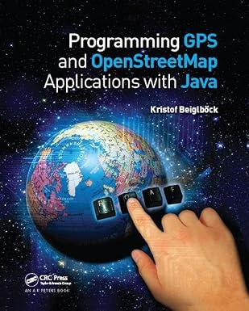

:toc: left

= repo content

This repository serves as development environment + 
for the  
https://www.amazon.com/Programming-GPS-OpenStreetMap-Applications-Java/dp/1138413747[The RealObject Application Framework] +
described in the book

// .Programming GPS and OpenStreetMap Applications with Java + The RealObject Application Framework

// align=center,

click image to get more details

== intro

Blue Marble Simulations `bm-sim` is a Java-based multi-module Maven project focused on GPS tracking simulations. 
It provides client-side tooling around Traccar, integrating it with Spring Boot and Apache Camel 
to simulate and process location data in real-time. 

=== latest versions

include::releases.adoc[lines=2..12]

For earlier versions check the 
xref:releases.adoc[version history] 

=== Quickstarts

The page you are reading is a description 
of the project structure and the development process. 

include::./quickstarts/bm-quickstarts.adoc[lines=5..8]

If you are looking for a quickstart to get started with each project, 
xref:./quickstarts/bm-quickstarts.adoc[goto quickstarts ...]

== `/workflows` 

include::workflows.adoc[lines=5..6]

xref:workflows.adoc[read on ...]

== `/bm-parent`

include::bm-parent/bm-parent.adoc[lines=7..19]

xref:bm-parent/bm-parent.adoc[read on ...]

== `/bm-tracker`

include::bm-tracker/bm-tracker.adoc[lines=6..12]

xref:./bm-tracker/bm-tracker.adoc[Global Positioning in Space & Time ...]

=== `gps-osmand-tracker`

// content file
include::bm-tracker/gps-osmand-tracker/gps-tracker.adoc[lines=5..17]

// index file
xref:./bm-tracker/gps-osmand-tracker/gps-osmand-tracker.adoc[read on ...]

=== `gps-osmand-player`

include::bm-tracker/gps-osmand-player/gps-osmand-player.adoc[lines=14..21]

xref:./bm-tracker/gps-osmand-player/gps-osmand-player.adoc[read on ...]

== Integrated Development

The GPS Tracker and Player were developed as client senders for the Traccar GTS.
Each project test is running standalone for each Unit.
For a _full integrated development cycle_ we run the Traccar Server in a Docker container 
and look into the server state with the Traccar REST API and websocket interface.
This development is done in the `bm-traccar` branch.
The `traccar-realtime-client` is an important milestone as it allows 
a _full roundtrip engineering_ in an integrated development cycle.

Therefor the longterm Tracker and Player development happen in the `traccar-realtime-client` project.

xref:./bm-traccar/traccar-realtime-client/integrated-dev-cycle.adoc#_integrated_tracker_development[read about the Integrated Development Cycle]

== `/bm-traccar` - GTS Remote Access

The `bm-traccar` aggregator POM is the development environment 
to code against the link:https://www.traccar.org/[Traccar GPS Tracking Platform].
Traccar is a GPS Tracking System (GTS) written in Java and published as Open Source Software.
The System was thoroughly analyzed in the 
link:https://github.com/kbeigl/jeets/blob/master/README.adoc[JeeTS Project]
and
link:https://github.com/kbeigl/jeets/blob/master/README.adoc#literature[JeeTS Book].

xref:./bm-traccar/bm-traccar.adoc[read more to setup and adopt your development environment]

As of `v1.1.x` we are developing the following three cascaded and yet independent artifacts as a _layered architecture_. +
The separation between 

- `traccar-openapitools-client` (generated)
- `traccar-api-client` (Java wrapper) 
- `traccar-realtime-client` (orchestration) 

is deliberate. 
The Api interface acts as a clean façade hiding all REST complexity.

=== Traccar Versioning

The `/bm-traccar` branch is developed against _every other_ stable Traccar version. +
Therefore the Traccar version is always updated for the complete `bm-traccar` branch, 

[source,text]
-----------------
    [INFO] ---- Traccar 6.12.2 Clients               --- 1.1.20
-----------------

and all three artifacts are released with the same Traccar version in their name, +
i.e. `${traccar.version}-${bm.version}`. 

[source,text]
-----------------
    [INFO] ..... traccar-openapitools-client      6.12.2 ......
    [INFO] ..... traccar-api-client               6.12.2-1.1.20
    [INFO] ..... traccar-realtime-client          6.12.2-1.1.20-RC
-----------------

In the prototyping phase no precautions are taken to ignore subtle differences to keep the code lean. +
For best experiences you should use a traccer server with the exact version,
which is the case, +
if you use the Docker image provided by the `bm-traccar` branch.

On the other hand we are not coding against the traccar implementation, 
but against the OpenAPI specification, which is more stable 
and less prone to breaking changes. 
During prototyping we are only implementing API methods 
that we need to progress for the main application's use cases.

Traccar REST API versions are always more than simple version bumps. +
Anyhow not every change is a breaking change due to this defensive approach.

=== `traccar-openapitools-client`

The Traccar REST API is defined in a single `openapi.yaml` file,
which is processed with the  
link:https://github.com/OpenAPITools/openapi-generator[OpenAPI Generator] 
to generate a plain Java Client `traccar-api-generated-x.y.z.jar` from the 
link:https://swagger.io/specification/[OpenAPI specification]. 

The client generation is done 'out of the box', meaning that the generator 
is invoked with Maven and there are no manual changes.

[TIP]
====
Therefor you can also download the released `jar` for your own purposes. 
====

xref:./bm-traccar/traccar-openapitools-client/openapitools.adoc[details ...]

=== `traccar-api-client`

The `traccar-api-client` is a Java Client Software to provide full (remote) control over your Traccar server.
And it can be used to integrate your Tracking System with your company systems, 
like Human Resources-, Sales- and Fleet Management Software.
Synchronize your employees with their cars and driver information without utilizing the traccar UI.
Pull driving reports for your sales team ... and much more ;) 

Technically the project is a higher-level Spring Boot & Camel REST client wrapper over the Traccar API.

xref:./bm-traccar/traccar-api-client/traccar-api-client.adoc[details ...]

=== `traccar-realtime-client`

The `traccar-rt-client` is a Java Client Software 
to provide full (remote) control over and interact 
via live surveillance of your Traccar Server Scenario. 
A dual-lock approach (`ConcurrentHashMap` for concurrent reads and `synchronized (deviceMapLock)` 
for multi-map atomic writes) always assures a stable realtime state.

xref:./bm-traccar/traccar-realtime-client/traccar-realtime-client.adoc[details ...]

=== `traccar-realtime-service`

The `traccar-realtime-service` is a Java Client Software 
to provide full (remote) control over and interact 
via live surveillance of your Traccar Server Scenario. 

This application is putting the Trackers, the Traccar API and the Traccar Client 
together to a general real time application,
which can be used to create a customized scenario, like a vehicle fleet.

A customized model can help to improve your business by observing and controlling your vehicles.

xref:./bm-traccar/traccar-realtime-app/traccar-realtime-app.adoc[details ...]

== `/bm-docs`

include::bm-docs/ascii-doctor.adoc[lines=1..10]

xref:bm-docs/ascii-doctor.adoc[read on ...]

== gps2gts2realtime *Milestone*

The `v1.1.x` prototyping of the two branches `/bm-tracker` and `/bm-traccar` is concluded with the `traccar-realtime-client`.
As a proof of concept we have implemented the full flow of data from the trackers to the server to the Real Time Client,
including the setup of a scenario on the server.

These ground layers of the ROAF are now in place and we can start building on top of them. +
Or they can be used as a solid basis for your own projects. 

Make sure to execute the 
xref:./bm-traccar/traccar-realtime-client/traccar-realtime-client-qs.adoc[Quickstart]
of the `traccar-realtime-client` to setup your development environment.

Then you can go into details and use a blueprint
xref:./bm-traccar/milestone/bm-traccar-milestone.adoc[here]
for your own step by step development of GPS tracking applications.

=== roundtrip engineering

Also Note that with the cycle Tracker2GTS2RealTime we start with roundtrip engineering 
on any of the involved Components with integrated Traccar Server. 

For example we can use the Traccar Server Events as a certified (i.e. Third Party) Tracker Event. 
Therfore you will find integration tests for 
xref:./bm-traccar/traccar-realtime-client/integrated-dev-cycle.adoc[Tracker development]
in the `traccar-realtime-client` project
using the Tracker's package names `bm.gps.tracker`. This is a common development cycle and 
the developer should be aware that the projects, like the Tracker and RealTimeClient
have to be compiled sequentially, before testing a new Tracker feature in the RealTimeClient project.

