# Class Diagrams

## Development Environment

### Flow Chart

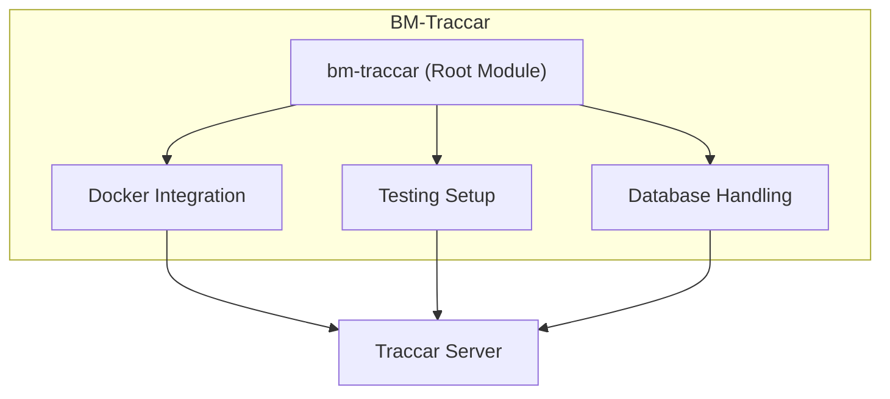
```mermaid
flowchart TD
    subgraph BM-Traccar
        bm-traccar["bm-traccar (Root Module)"]
        docker-integration["Docker Integration"]
        testing-setup["Testing Setup"]
        database-handling["Database Handling"]
    end

    traccar-server["Traccar Server"]

    bm-traccar --> docker-integration
    bm-traccar --> testing-setup
    bm-traccar --> database-handling

    docker-integration --> traccar-server
    testing-setup --> traccar-server
    database-handling --> traccar-server
```

### Class Diagram

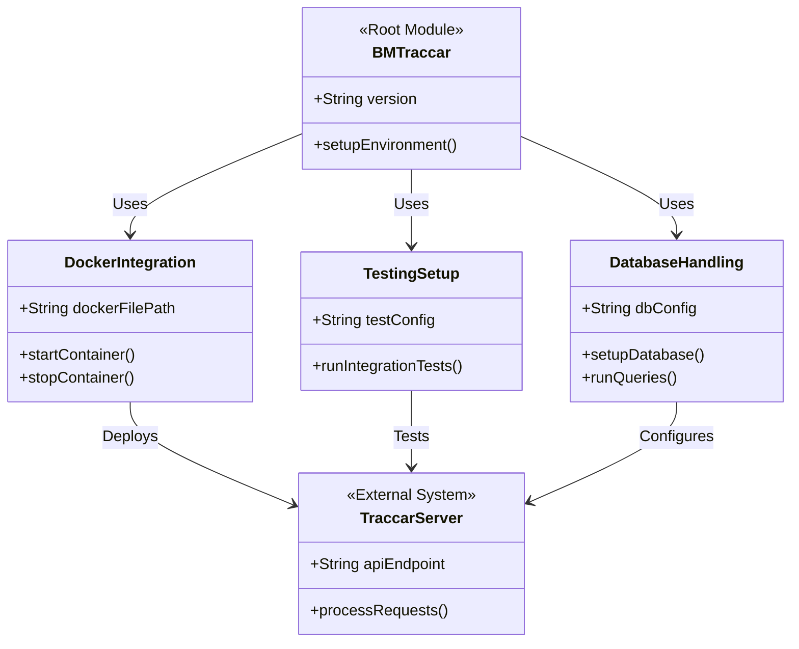
```mermaid
classDiagram
    class BMTraccar {
        <<Root Module>>
        +String version
        +setupEnvironment()
    }

    class DockerIntegration {
        +String dockerFilePath
        +startContainer()
        +stopContainer()
    }

    class TestingSetup {
        +String testConfig
        +runIntegrationTests()
    }

    class DatabaseHandling {
        +String dbConfig
        +setupDatabase()
        +runQueries()
    }

    class TraccarServer {
        <<External System>>
        +String apiEndpoint
        +processRequests()
    }

    BMTraccar --> DockerIntegration : Uses
    BMTraccar --> TestingSetup : Uses
    BMTraccar --> DatabaseHandling : Uses

    DockerIntegration --> TraccarServer : Deploys
    TestingSetup --> TraccarServer : Tests
    DatabaseHandling --> TraccarServer : Configures
```

**BMTraccar**: The root module that orchestrates the submodules.

**DockerIntegration**: Manages the Dockerized Traccar server.

**TestingSetup**: Runs integration tests against the Traccar server.

**DatabaseHandling**: Configures and manages the database for Traccar.

**TraccarServer**: Represents the external Traccar server.

This diagram shows the relationships and responsibilities of each component in the bm-traccar project.

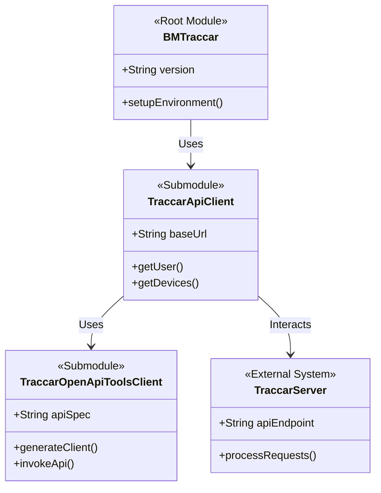
```mermaid
classDiagram
    class BMTraccar {
        <<Root Module>>
        +String version
        +setupEnvironment()
    }

    class TraccarApiClient {
        <<Submodule>>
        +String baseUrl
        +getUser()
        +getDevices()
    }

    class TraccarOpenApiToolsClient {
        <<Submodule>>
        +String apiSpec
        +generateClient()
        +invokeApi()
    }

    class TraccarServer {
        <<External System>>
        +String apiEndpoint
        +processRequests()
    }

    BMTraccar --> TraccarApiClient : Uses
    TraccarApiClient --> TraccarOpenApiToolsClient : Uses

    TraccarApiClient --> TraccarServer : Interacts
```

Explanation:
BMTraccar: The root module that orchestrates the submodules.
TraccarApiClient: Handles API interactions with the Traccar server.
TraccarOpenApiToolsClient: Generates and invokes API clients based on OpenAPI specifications.
DockerIntegration: Manages the Dockerized Traccar server.
TestingSetup: Runs integration tests against the Traccar server.
DatabaseHandling: Configures and manages the database for Traccar.
TraccarServer: Represents the external Traccar server.
This diagram shows the relationships and responsibilities of each component in the bm-traccar project, including the traccar-openapitools-client.

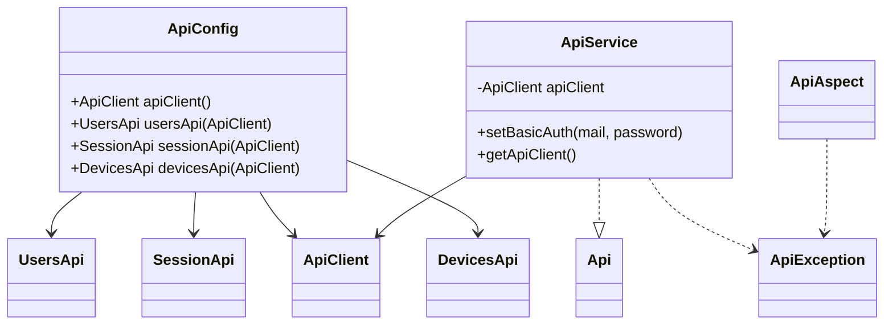
```mermaid
classDiagram

    class ApiConfig {
        +ApiClient apiClient()
        +UsersApi usersApi(ApiClient)
        +SessionApi sessionApi(ApiClient)
        +DevicesApi devicesApi(ApiClient)
    }
    class ApiService {
        -ApiClient apiClient
        +setBasicAuth(mail, password)
        +getApiClient()
    }
    class ApiAspect
    class ApiException

    ApiService ..|> Api
    ApiService --> ApiClient
    ApiConfig --> ApiClient
    ApiConfig --> UsersApi
    ApiConfig --> SessionApi
    ApiConfig --> DevicesApi
    ApiAspect ..> ApiException
    ApiService ..> ApiException
```

# Sequence Diagram

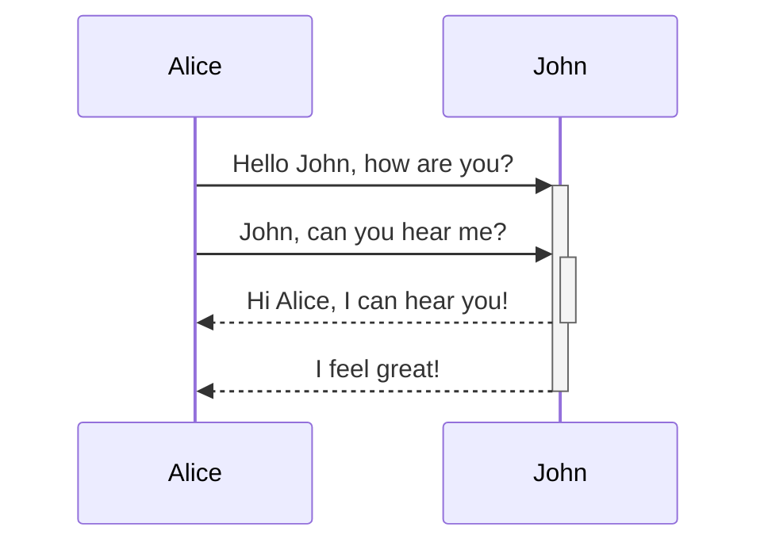
```mermaid
sequenceDiagram
  Alice->>+John: Hello John, how are you?
  Alice->>+John: John, can you hear me?
  John-->>-Alice: Hi Alice, I can hear you!
  John-->>-Alice: I feel great!
```

# State Diagram

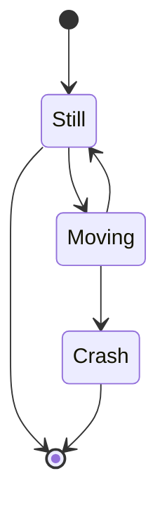
```mermaid
stateDiagram-v2
  [*] --> Still
  Still --> [*]
  Still --> Moving
  Moving --> Still
  Moving --> Crash
  Crash --> [*]
```

# ER Diagram

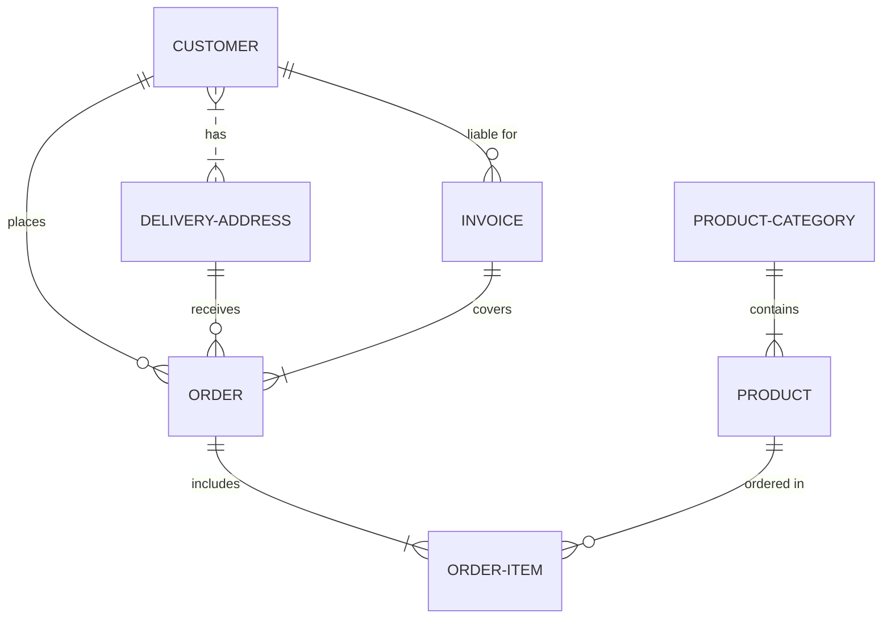
```mermaid
erDiagram
  CUSTOMER }|..|{ DELIVERY-ADDRESS : has
  CUSTOMER ||--o{ ORDER : places
  CUSTOMER ||--o{ INVOICE : "liable for"
  DELIVERY-ADDRESS ||--o{ ORDER : receives
  INVOICE ||--|{ ORDER : covers
  ORDER ||--|{ ORDER-ITEM : includes
  PRODUCT-CATEGORY ||--|{ PRODUCT : contains
  PRODUCT ||--o{ ORDER-ITEM : "ordered in"
```

# Gantt Chart

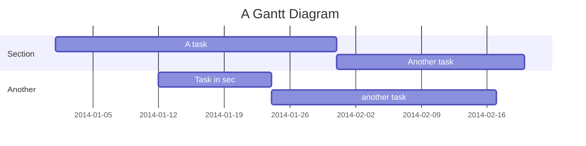
```mermaid
gantt
  title A Gantt Diagram
  dateFormat  YYYY-MM-DD
  section Section
  A task           :a1, 2014-01-01, 30d
  Another task     :after a1  , 20d
  section Another
  Task in sec      :2014-01-12  , 12d
  another task      : 24d
```

# User Journey

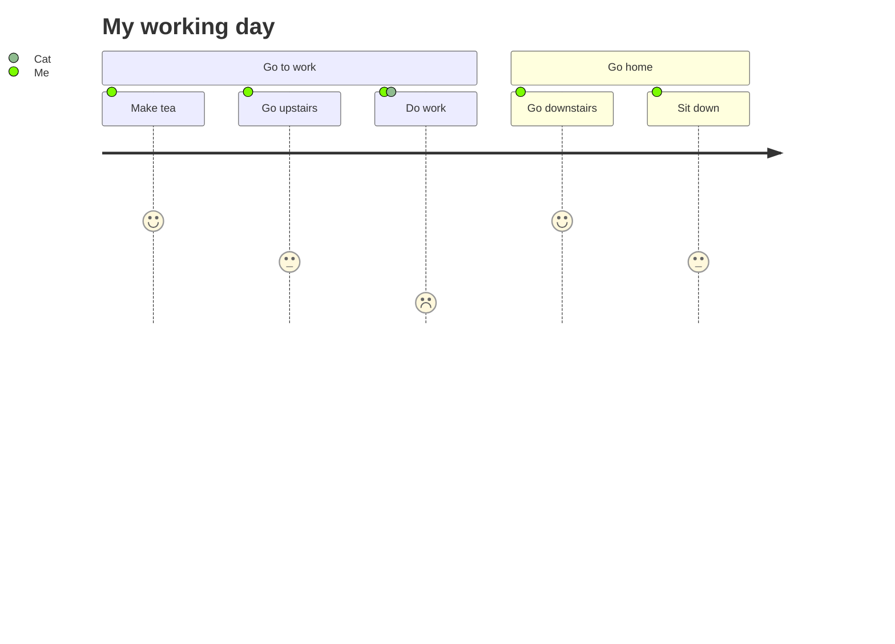
```mermaid
journey
  title My working day
  section Go to work
    Make tea: 5: Me
    Go upstairs: 3: Me
    Do work: 1: Me, Cat
  section Go home
    Go downstairs: 5: Me
    Sit down: 3: Me
```

# Timeline

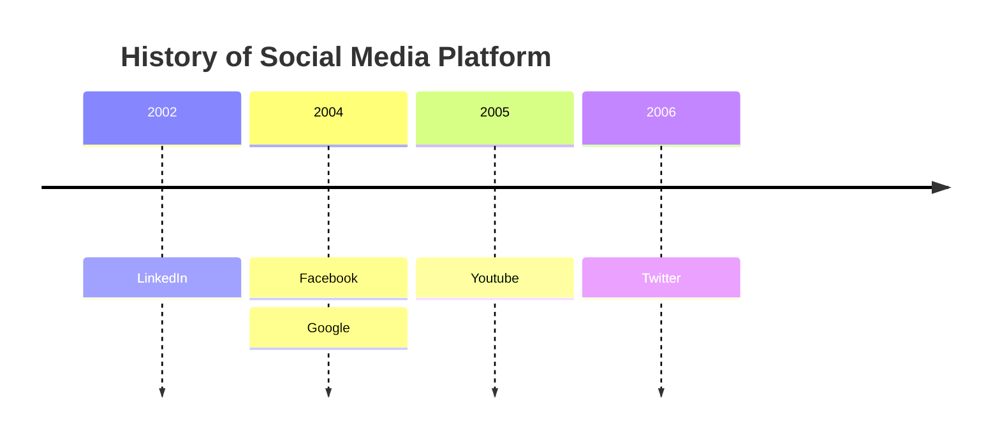
```mermaid
timeline
  title History of Social Media Platform
  2002 : LinkedIn
  2004 : Facebook
       : Google
  2005 : Youtube
  2006 : Twitter
```

# Git

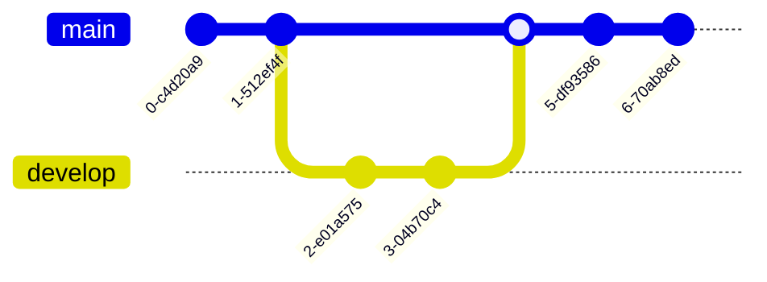
```mermaid
gitGraph
  commit
  commit
  branch develop
  checkout develop
  commit
  commit
  checkout main
  merge develop
  commit
  commit
```

# Pie Chart

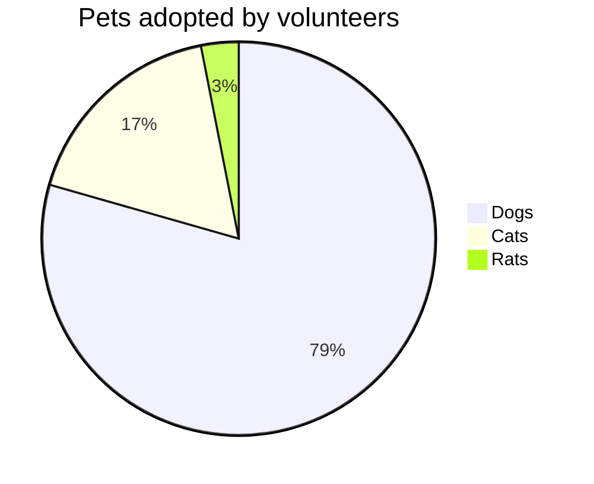
```mermaid
pie title Pets adopted by volunteers
  "Dogs" : 386
  "Cats" : 85
  "Rats" : 15       
```

# Mindmap

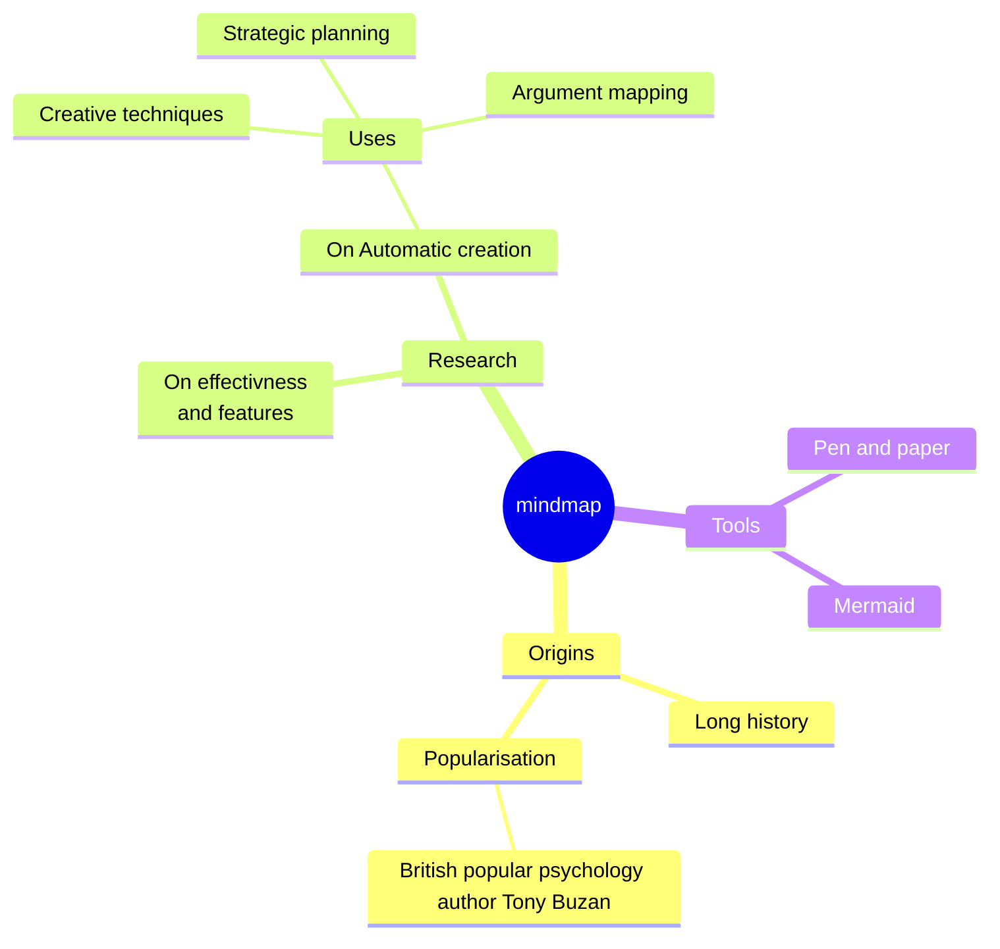
```mermaid
mindmap
  root((mindmap))
    Origins
      Long history
      ::icon(fa fa-book)
      Popularisation
        British popular psychology author Tony Buzan
    Research
      On effectivness<br/>and features
      On Automatic creation
        Uses
            Creative techniques
            Strategic planning
            Argument mapping
    Tools
      Pen and paper
      Mermaid
```

# Quadrant Chart

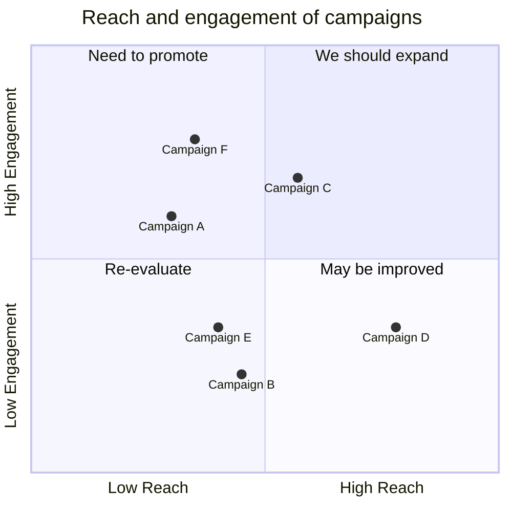
```mermaid
quadrantChart
  title Reach and engagement of campaigns
  x-axis Low Reach --> High Reach
  y-axis Low Engagement --> High Engagement
  quadrant-1 We should expand
  quadrant-2 Need to promote
  quadrant-3 Re-evaluate
  quadrant-4 May be improved
  Campaign A: [0.3, 0.6]
  Campaign B: [0.45, 0.23]
  Campaign C: [0.57, 0.69]
  Campaign D: [0.78, 0.34]
  Campaign E: [0.40, 0.34]
  Campaign F: [0.35, 0.78]
```

# C4 Diagram

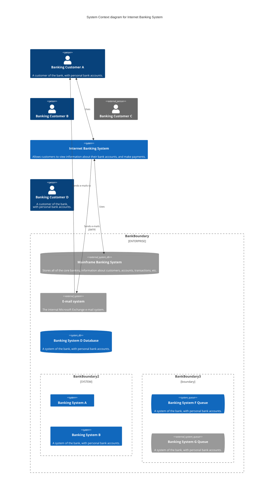
```mermaid
C4Context
title System Context diagram for Internet Banking System

Person(customerA, "Banking Customer A", "A customer of the bank, with personal bank accounts.")
Person(customerB, "Banking Customer B")
Person_Ext(customerC, "Banking Customer C")
System(SystemAA, "Internet Banking System", "Allows customers to view information about their bank accounts, and make payments.")

Person(customerD, "Banking Customer D", "A customer of the bank, <br/> with personal bank accounts.")

Enterprise_Boundary(b1, "BankBoundary") {

  SystemDb_Ext(SystemE, "Mainframe Banking System", "Stores all of the core banking information about customers, accounts, transactions, etc.")

  System_Boundary(b2, "BankBoundary2") {
    System(SystemA, "Banking System A")
    System(SystemB, "Banking System B", "A system of the bank, with personal bank accounts.")
  }

  System_Ext(SystemC, "E-mail system", "The internal Microsoft Exchange e-mail system.")
  SystemDb(SystemD, "Banking System D Database", "A system of the bank, with personal bank accounts.")

  Boundary(b3, "BankBoundary3", "boundary") {
    SystemQueue(SystemF, "Banking System F Queue", "A system of the bank, with personal bank accounts.")
    SystemQueue_Ext(SystemG, "Banking System G Queue", "A system of the bank, with personal bank accounts.")
  }
}

BiRel(customerA, SystemAA, "Uses")
BiRel(SystemAA, SystemE, "Uses")
Rel(SystemAA, SystemC, "Sends e-mails", "SMTP")
Rel(SystemC, customerA, "Sends e-mails to")
```

# Requirement Diagram

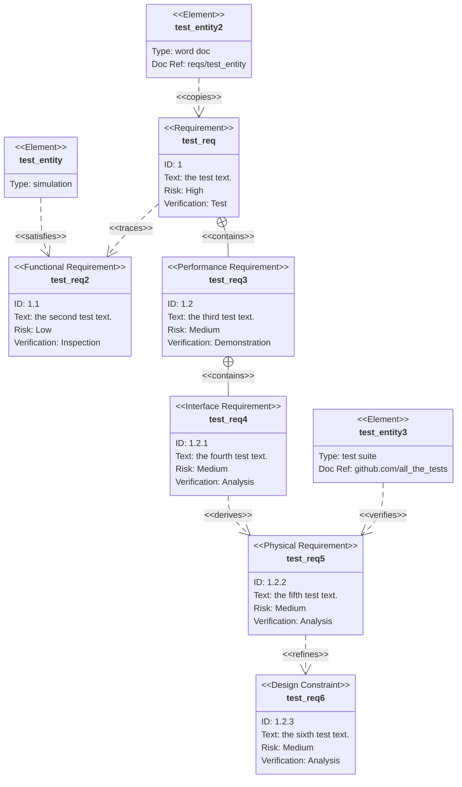
```mermaid
requirementDiagram
  accTitle: Requirments demo in black and white
  accDescr: A series of requirement boxes showing relationships among them. Has meaningless task names

requirement test_req {
id: 1
text: the test text.
risk: high
verifymethod: test
}

functionalRequirement test_req2 {
id: 1.1
text: the second test text.
risk: low
verifymethod: inspection
}

performanceRequirement test_req3 {
id: 1.2
text: the third test text.
risk: medium
verifymethod: demonstration
}

interfaceRequirement test_req4 {
id: 1.2.1
text: the fourth test text.
risk: medium
verifymethod: analysis
}

physicalRequirement test_req5 {
id: 1.2.2
text: the fifth test text.
risk: medium
verifymethod: analysis
}

designConstraint test_req6 {
id: 1.2.3
text: the sixth test text.
risk: medium
verifymethod: analysis
}

element test_entity {
type: simulation
}

element test_entity2 {
type: word doc
docRef: reqs/test_entity
}

element test_entity3 {
type: "test suite"
docRef: github.com/all_the_tests
}


test_entity - satisfies -> test_req2
test_req - traces -> test_req2
test_req - contains -> test_req3
test_req3 - contains -> test_req4
test_req4 - derives -> test_req5
test_req5 - refines -> test_req6
test_entity3 - verifies -> test_req5
test_req <- copies - test_entity2
```

# Sankey Diagram

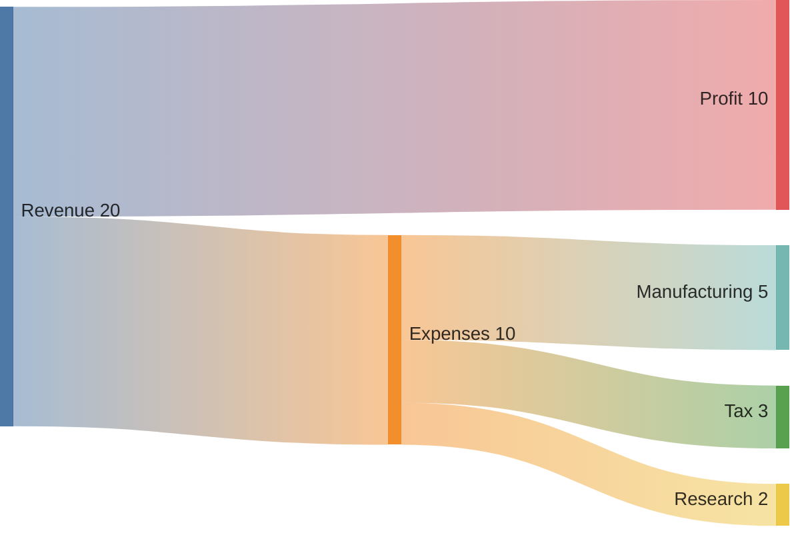
```mermaid
sankey-beta
  Revenue,Expenses,10
  Revenue,Profit,10
  Expenses,Manufacturing,5
  Expenses,Tax,3
  Expenses,Research,2
```

# XY Chart

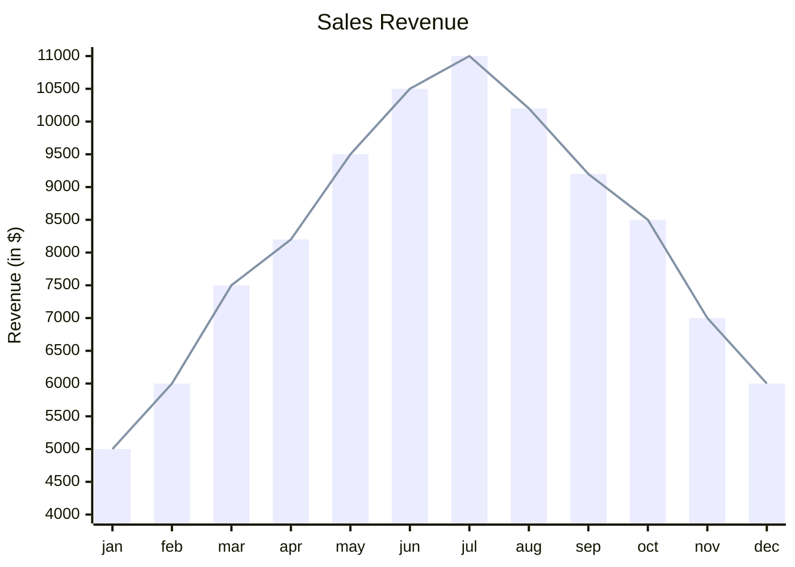
```mermaid
xychart-beta
  title "Sales Revenue"
  x-axis [jan, feb, mar, apr, may, jun, jul, aug, sep, oct, nov, dec]
  y-axis "Revenue (in $)" 4000 --> 11000
  bar [5000, 6000, 7500, 8200, 9500, 10500, 11000, 10200, 9200, 8500, 7000, 6000]
  line [5000, 6000, 7500, 8200, 9500, 10500, 11000, 10200, 9200, 8500, 7000, 6000]
```

# Block Chart

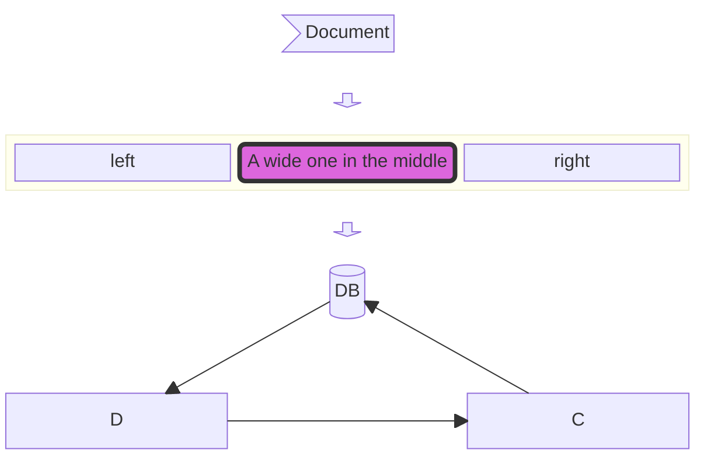
```mermaid
block-beta
  columns 3
  doc>"Document"]:3
  space down1<[" "]>(down) space

  block:e:3
    l["left"]
    m("A wide one in the middle")
    r["right"]
  end
    space down2<[" "]>(down) space
    db[("DB")]:3
    space:3
    D space C
    db --> D
    C --> db
    D --> C
    style m fill:#d6d,stroke:#333,stroke-width:4px
```

