:toc:

= Traccar Client Development

The `bm-traccar` module, i.e. Maven subbranch, is the development environment 
for integrating with the  
link:https://www.traccar.org/[Traccar GPS Tracking Platform].
Traccar is a GPS Tracking System (GTS) written in Java and published as Open Source Software.
The System was thoroughly analyzed in the 
link:https://github.com/kbeigl/jeets/blob/master/README.adoc[JeeTS Project]
and
link:https://github.com/kbeigl/jeets/blob/master/README.adoc#literature[JeeTS Book].

This module provides a development environment with different database setups,
different server instances: remote, local IDE, local service or 
dockerized for automated integration testing

Please read the following instructions to get the most out of your development.

== Dockerized Traccar Server

The Traccar Client Software is developed with Integration Tests against a Docker Traccar Server.

link:./dox/dockerSetup.adoc[Read on to fetch, build and run the Traccar docker container ...]

== Database handling

After setting up the Traccar Docker Container there are different options to set up the database
according to your development focus. The Database (ERM) can be perceived as the backdoor
through which you can peek into the data and analyze the actions of your integration tests.

link:./dox/databaseTest.adoc[read more ...]

== Testing with Traccar Server

The Traccar Clients are basically an interface between REST and Java passing Entities. 
Therefor there is no need for cumbersom JUnit test setups
to test the technology we rely on.
The functionality is achieved by wiring diffent technology components
together, configure and run them.

link:./dox/testSetup.adoc[read more ...]

== Traccar Server Upgrade

This root module that defines the Traccar version for all submodules 

        <traccar.version>6.8.0</traccar.version>
