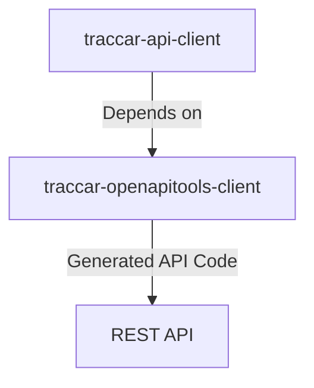
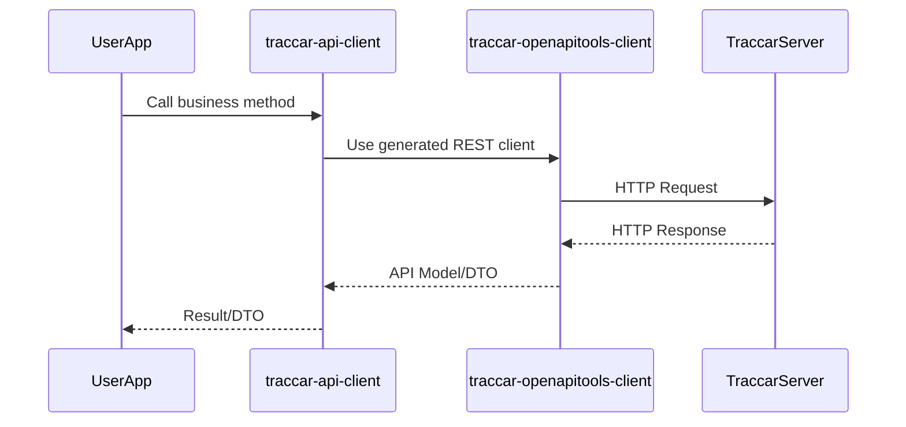
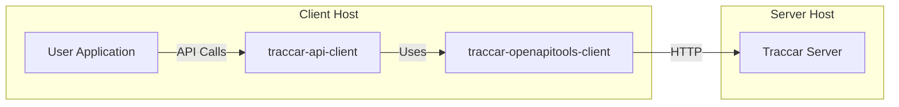

# Traccar API Client Architecture (Revised)

## Key Architectural Characteristics

- **Separation of Concerns**: The architecture separates generated API code (`traccar-openapitools-client`) from business logic and integration code (`traccar-api-client`).
- **Generated API Layer**: All REST API models and client classes are generated from the Traccar OpenAPI spec and maintained in `traccar-openapitools-client`.
- **Extensible Client**: `traccar-api-client` wraps and extends the generated API, providing a stable interface for application developers.

---

## Project Structure

The following diagram shows the relationship between the two main projects:

---

## Component Interaction (Runtime Flow)

This sequence diagram illustrates how components interact at runtime for REST API calls:

---

## Deployment Architecture

The deployment diagram below shows how the components are deployed and interact with the Traccar server:

---

## Component Types

- **traccar-api-client**: Contains business logic, integration code, and references the generated API.
- **traccar-openapitools-client**: Contains only generated REST API models and client classes.

---
