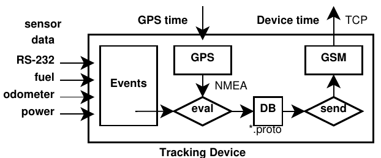

:toc: left
:toclevels: 3
:doctype: book

// when file size becomes too big
// include::gps-tracker.adoc[]
// include::gps-tracker-impl.adoc[]
// include::gps-tracker-arc.adoc[]

= The GPS Player

[NOTE]
====
Note that we are citing original texts from  
link:https://www.amazon.com/GPS-Tracking-Java-Components-Challenges/dp/1138054941[GPS Tracking with Java EE Components] +
_Chapter 9 The JeeTS Player_ describes the need and the making of a GPS Player. +
Find an implementation to playback proprietary files in the
https://github.com/kbeigl/jeets/tree/master/jeets-clients/jeets-player[JeeTS repo]
====

Requires a `gps-*-tracker`

see file:///home/kbeigl/git/bm/bm-tracker/gps-osmand-tracker/src/asciidoc/gps-osmand-tracker.html#_requirements[tracker requirements]

== implementation steps

- [ ]  one
- [x]  two
